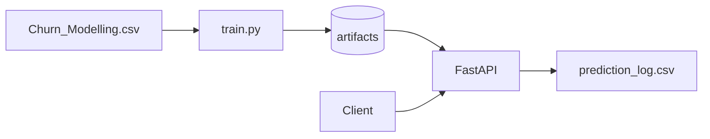

# Churn MLDevOps

Đồ án / lab **MLOps**: dự đoán **churn** trên `Churn_Modelling.csv` — **train** (nhiều model sklearn, chọn theo F1) → **artifact** (`joblib` + `manifest.json`) → **FastAPI** → **log CSV** + **drift (rule + PSI)** → **Docker** → **GitHub Actions** (pytest, build image, deploy hook).

Tài liệu chi tiết A–Z (bảo vệ, viva): [`docs/PROJECT_KNOWLEDGE_A_TO_Z.md`](docs/PROJECT_KNOWLEDGE_A_TO_Z.md).

---

## Kiến trúc tóm tắt



---

## Yêu cầu

- Python **3.11+** (Dockerfile dùng 3.11)
- File dữ liệu `Churn_Modelling.csv` ở thư mục gốc project (hoặc chỉnh `DATA_PATH`)

---

## Cài đặt & chạy local

```bash
python -m venv .venv
# Windows
.venv\Scripts\activate
# macOS/Linux
# source .venv/bin/activate

pip install -r requirements.txt
python train.py
uvicorn app:app --reload --port 8000
```

- **OpenAPI / Swagger:** http://127.0.0.1:8000/docs  
- **Health:** `GET /health`  
- **Dự đoán:** `POST /predict`  
- **Metadata model:** `GET /model-info` (manifest + metric test)

---

## Docker

```bash
docker compose up --build
```

Image chạy `python train.py` lúc **build** để luôn có `best_model.pkl` trong image. `docker-compose` có thể mount `./artifacts` để xem log/metrics trên máy.

---

## Biến môi trường

| Biến | Mặc định | Mô tả |
|------|----------|--------|
| `DATA_PATH` | `./Churn_Modelling.csv` | CSV huấn luyện |
| `ARTIFACTS_DIR` | `./artifacts` | Thư mục output |
| `MODEL_PATH` | `$ARTIFACTS_DIR/best_model.pkl` | Artifact inference |
| `PREDICTION_LOG_PATH` | `$ARTIFACTS_DIR/prediction_log.csv` | Log request |

---

## Huấn luyện & output

```bash
python train.py
```

Sinh (trong `ARTIFACTS_DIR`):

- `best_model.pkl` — model + encoders + `feature_columns` + stats/histogram + `manifest`
- `manifest.json` — `data_sha256`, `git_commit`, `sklearn_version`, metric chọn model
- `metrics.json` — metric từng model + `classification_report`

**Chọn model:** ưu tiên **F1** trên tập test, tie-break **ROC-AUC** → **average precision**.

---

## Monitoring (API)

- **Rule drift:** lệch tuổi / số dư so với mean trên tập train đã cân bằng.
- **PSI:** so phân phối **Age** và **Balance** (cửa sổ log gần đây, tối thiểu ~30 dòng) với histogram lúc train; ngưỡng PSI mặc định **0.25**.

Chi tiết: xem `src/churn_mldevops/monitoring.py` và doc A–Z.

---

## Responsible AI (offline)

```bash
python scripts/responsible_ai_report.py
```

Ghi `artifacts/responsible_ai_report.json`: slice theo Geography/Gender, permutation importance, mục **limitations**.

---

## Tests

```bash
pytest -q tests
```

`tests/conftest.py` train vào **thư mục tạm** (qua `ARTIFACTS_DIR` / `MODEL_PATH`) để CI không phụ thuộc `artifacts/` local.

---

## CI/CD

File `.github/workflows/ci.yml`:

1. Cài dependency → **pytest**
2. **Docker build** (sau khi test pass)
3. Trên nhánh `main`: push image lên **GHCR** + gọi **Render deploy hook** (cần secret `RENDER_DEPLOY_HOOK_URL`)

`render.yaml` mô tả service web Docker trên Render (health: `/health`).

---

## Cấu trúc thư mục chính

| Đường dẫn | Nội dung |
|-----------|----------|
| `app.py` | FastAPI |
| `train.py` | Gọi `churn_mldevops.train.train_and_save` |
| `src/churn_mldevops/` | `config`, `pipeline`, `train`, `monitoring` |
| `tests/` | pytest |
| `scripts/responsible_ai_report.py` | Báo cáo RA |
| `docs/PROJECT_KNOWLEDGE_A_TO_Z.md` | Kiến thức & câu hỏi viva |

---

## Thiết kế (tóm tắt rubric)

| Quyết định | Lý do ngắn |
|------------|------------|
| **FastAPI** | Schema/Pydantic, OpenAPI sẵn, hợp microservice scoring |
| **Model file (`joblib`)** | Đơn giản, tái lập; kèm `manifest` để truy vết |
| **CSV log** | Demo nhanh; production nên DB/queue + metrics backend |

---

## License / môn học

Dự án phục vụ mục đích học tập (FPT / MLOps). Dữ liệu `Churn_Modelling` thường dùng trong các khóa ML công khai.
